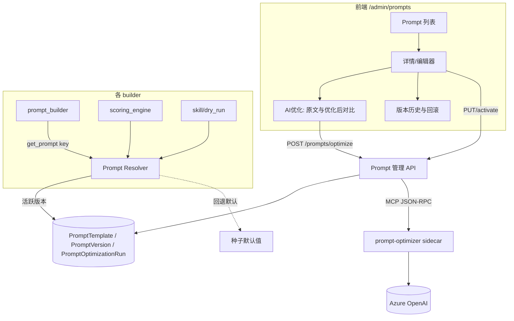

# Prompt Optimizer 集成与统一 Prompt 管理研究

本研究描述如何通过方案 A 集成开源工具 [prompt-optimizer](https://github.com/linshenkx/prompt-optimizer)，对本工程所有 prompt 进行优化，保留优化过程、版本与历史，并提供统一的前端管理界面。

- 相关工程规范：[CLAUDE.md](../../CLAUDE.md)
- 相关需求文档：[requirements.md](../../docs/requirements.md)

## 一、需求拆解

将"通过 prompt-optimizer 优化所有 prompt、保留优化过程/版本/历史、提供统一管理 UI"拆分为以下功能项。

| 编号 | 功能项 | 含义 |
|------|--------|------|
| F1 | 集成 prompt-optimizer（方案 A） | Docker sidecar 加后端 MCP 客户端，提供优化能力 |
| F2 | 覆盖所有 prompt | 将工程内散落的 9 处 prompt 全部纳入统一管理 |
| F3 | 保留优化过程 | 每次 AI 优化记录原文、优化后文本、所用模板、改进要求、模型、时间、操作人 |
| F4 | 版本与历史 | 每个 prompt 拥有版本链，可查看历史并回滚 |
| F5 | 统一管理 UI | admin 后台提供单一 Prompt 管理入口，集中查看、编辑、优化、对比、回滚 |

## 二、现状盘点

工程内存在 9 处 prompt，仅 `scoring.rubric` 拥有真正的版本机制，其余多为源码硬编码。

| Key（建议） | 位置 | 当前形态 | 可编辑 | 有版本 |
|-------------|------|---------|:------:|:------:|
| `hcp.system` | [prompt_builder.py](../../backend/app/services/prompt_builder.py) `build_hcp_system_prompt` | 硬编码 | 否 | 否 |
| `key_message.detection` | prompt_builder `build_key_message_detection_prompt` | 硬编码 | 否 | 否 |
| `scoring.base` | [scoring_engine.py](../../backend/app/services/scoring_engine.py) `SCORING_PROMPT_TEMPLATE` | 模块常量 | 间接 | 否 |
| `scoring.rubric`（每实体） | [scoring_rubric.py](../../backend/app/models/scoring_rubric.py) `prompt_template` | 数据库，admin 可编辑 | 是 | 是（`prompt_version`） |
| `conference.audience`（每实体） | [conference_prompt_config.py](../../backend/app/services/conference_prompt_config.py) | 数据库（scenario）加默认常量 | 是 | 否 |
| `conference.moderator` | conference_prompt_config `moderator_remarks` | 默认常量 | 部分 | 否 |
| `skill.sop_extraction` | [skill_conversion_service.py](../../backend/app/services/skill_conversion_service.py) `SOP_EXTRACTION_PROMPT` | 硬编码 | 否 | 否 |
| `skill.ai_feedback` | skill_conversion_service `AI_FEEDBACK_PROMPT` | 硬编码 | 否 | 否 |
| `dry_run.sop_eval` | [dry_run_engine.py](../../backend/app/services/dry_run_engine.py) `_SOP_EVAL_PROMPT` | 硬编码 | 否 | 否 |

区分两类 prompt。

- 全局单例：`hcp.system`、`key_message.detection`、`scoring.base`、`skill.*`、`dry_run.*`。进入注册中心，拥有完整版本、历史、优化能力。
- 每实体：`scoring.rubric`（每 rubric 一份）、`conference.audience`（每 scenario 一份）。复用同一套优化 API 与版本组件，版本归属到各自实体。

## 三、目标架构

采用 Registry-with-Fallback 模式，支持增量迁移且不破坏现有行为。



`get_prompt(key)` 从数据库读取活跃版本；无记录时回退到原硬编码默认值（启动时 seed 为版本 1）。每个 builder 从硬编码字符串改为 `get_prompt(key)`。由于默认版本内容等于原硬编码，行为保持不变，可逐个迁移。

### 数据模型

系统新增 3 张表。

- `PromptTemplate`：`key`（唯一）、`name`、`category`、`description`、`variables`（允许的占位符列表）、`active_version_id`、`is_system`（保护内置项）。
- `PromptVersion`：`template_id`、`version_no`、`content`、`source`（seed/manual/optimized/iterate）、`parent_version_id`、`note`、`created_by`、`created_at`、`is_active`。
- `PromptOptimizationRun`（对应 F3 优化过程）：`template_id`、`base_version_id`、`mode`（system/user/iterate）、`optimizer_template`、`requirements`、`result_content`、`model`、`status`、`created_by`、`created_at`、`resulting_version_id`（采用后回填）。

### MCP 工具契约

prompt-optimizer 的 MCP 服务通过 JSON-RPC 2.0 over Streamable HTTP 暴露 3 个工具，需要 initialize 握手，无法用 curl 直接调用，后端使用官方 `mcp` Python SDK 的 `streamablehttp_client` 访问。

| 工具 | 必填参数 | 可选参数 | 返回 |
|------|---------|---------|------|
| `optimize-system-prompt` | `prompt` | `template` | `content[0].text` |
| `optimize-user-prompt` | `prompt` | `template` | `content[0].text` |
| `iterate-prompt` | `prompt`、`requirements` | `template` | `content[0].text` |

## 四、执行步骤

每个需求遵循 [CLAUDE.md](../../CLAUDE.md) 的单需求流程：实现、单元测试 100% 覆盖、Playwright E2E、全部通过、commit 并 push，然后进入下一个需求。

### 需求 0：前置验证（非代码）

先完成此步，最早暴露唯一硬约束。

- 完成 AGPL 法务确认，以独立容器、网络调用、不改源码方式使用。
- 执行 Azure `/v1` 兼容性 smoke：启动 sidecar，用 MCP Inspector 或最小 Python 脚本确认 `optimize-system-prompt` 通过 Azure OpenAI 返回结果。若不通，加入 LiteLLM 代理 sidecar 兜底。
- 产出：可优化的结论，以及确定的 Azure 端点方案。

### 需求 1：优化能力打通

- 修改 [docker-compose.yml](../../docker-compose.yml)，加入 `prompt-optimizer` 服务，pin 版本、内网 expose、设置 `MCP_DEFAULT_MODEL_PROVIDER=custom` 指向 Azure。
- 新增 `backend/app/services/prompt_optimizer_client.py`，用 `mcp` SDK 封装 3 个工具。
- 新增 `backend/app/api/prompts.py`，提供 `POST /api/v1/prompts/optimize`，只返回结果不落库，并在 [main.py](../../backend/app/main.py) 注册。
- 测试：pytest mock MCP 客户端，覆盖三模式与错误分支，达到 100%。

示例 sidecar 配置：

```yaml
prompt-optimizer:
  image: linshen/prompt-optimizer:2.11.7
  environment:
    VITE_CUSTOM_API_BASE_URL: "https://<your-res>.openai.azure.com/openai/v1"
    VITE_CUSTOM_API_KEY: "${AZURE_OPENAI_API_KEY}"
    VITE_CUSTOM_API_MODEL: "${AOAI_DEPLOYMENT}"
    MCP_DEFAULT_MODEL_PROVIDER: custom
    MCP_DEFAULT_LANGUAGE: zh
  expose:
    - "80"
  healthcheck:
    test: ["CMD", "wget", "-qO-", "http://localhost/healthz"]
    interval: 30s
    timeout: 5s
    retries: 3
```

### 需求 2：Prompt 注册中心

- 新增 3 个 model 与 Alembic migration，并在 `alembic/env.py` 中 import 新模型。
- 新增 `backend/app/services/prompt_registry.py`，提供 `get_prompt(key)`，读取活跃版本并回退默认。
- 启动种子将 9 个 prompt 注册为版本 1，`source=seed`。
- 此步不改任何 builder 调用点，只保证 resolver 与默认值一致。pytest 覆盖 resolver、回退、种子。

### 需求 3：各 builder 切换到 registry

- 将 `prompt_builder`、`scoring_engine`、`skill_conversion_service`、`dry_run_engine` 从硬编码改为 `get_prompt(key)`。
- 用快照回归测试保证输出与迁移前一致。

### 需求 4：Prompt 管理 REST API

提供以下接口。静态路由排在参数路由之前，`is_system` 保护内置项不被删除。

- `GET /prompts` 列表
- `GET /prompts/{key}` 详情
- `PUT /prompts/{key}` 存为新手动版本
- `GET /prompts/{key}/versions` 版本列表
- `GET /prompts/{key}/runs` 优化记录列表
- `POST /prompts/{key}/activate/{version_no}` 回滚或切换活跃版本
- `POST /prompts/{key}/adopt` 将某次优化记录采用为新版本

测试：pytest 达到 100%。

### 需求 5：前端统一管理 UI

- 导航：在 [admin-layout.tsx](../../frontend/src/components/layouts/admin-layout.tsx) 的 `sidebarGroups` `content` 组加入 `{ path: "/admin/prompts", labelKey: "prompts", icon: FileText }`，并补充 i18n `nav` 词条。
- 路由：在 [router/index.tsx](../../frontend/src/router/index.tsx) 加入 `prompts` 列表页与 `prompts/:key` 编辑页，使用 lazy 加载。
- 页面：列表展示 key、名称、分类、活跃版本、最近优化；编辑器提供内容编辑、占位符提示、AI 优化按钮（mode 选择，iterate 显示改进要求输入，调用 optimize 后展示原文与优化后 diff 弹窗，支持采用为新版本）、版本历史列表与回滚、优化记录历史与前后对比。
- hooks：新增 `use-prompts.ts` domain hook，禁止组件内联 useQuery。
- 测试：vitest 覆盖按钮、对比、采用、回滚；Playwright E2E 覆盖核心用户故事（进入、AI 优化、对比、采用、回滚生效）。

### 需求 6：每实体 prompt 接入与 Azure 部署

- 将 `scoring.rubric`（[rubric-editor.tsx](../../frontend/src/pages/admin/rubric-editor.tsx)）与 `conference.audience`（[conference-audience-config.tsx](../../frontend/src/components/admin/conference-audience-config.tsx)）复用 optimize API 与版本组件。rubric 沿用已有 `prompt_version`，scenario 补充版本字段。
- 在 [infra/azure](../../infra/azure) 中将 sidecar 部署为 internal-ingress 的 Container App，密钥走 Key Vault 与 Managed Identity。
- 测试并提交。

## 五、关键风险

| 风险 | 缓解 |
|------|------|
| Azure `/v1` 兼容不通（最可能） | 加入 LiteLLM 代理 sidecar 兜底，需求 0 先验证 |
| AGPL 合规 | 独立容器、不改源码、pin 版本、法务签字 |
| 大范围迁移改坏现有行为 | Registry 回退默认加快照回归测试，需求 2 与 3 保证内容不变 |
| MCP 需握手不能 curl | 用官方 `mcp` SDK，先用 Inspector 验证再写后端 |
| 每实体与全局 prompt 混淆 | 全局进注册中心，每实体复用组件、版本归属实体（需求 6） |

## 六、建议起点

先执行需求 0（法务与 Azure 连通性 smoke）。这是整个方案唯一的硬约束，通过后按需求 1 至 6 顺序推进。每个需求独立 commit 并 push，单元测试 100% 覆盖，关键路径附 E2E。
