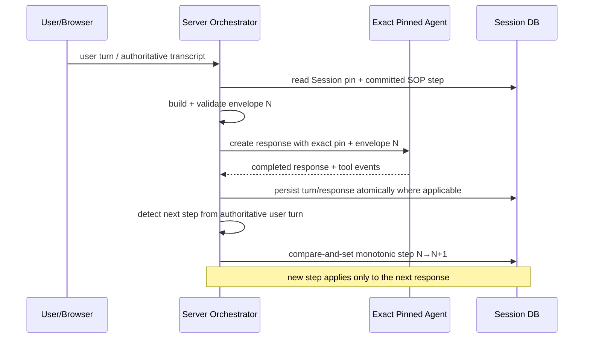
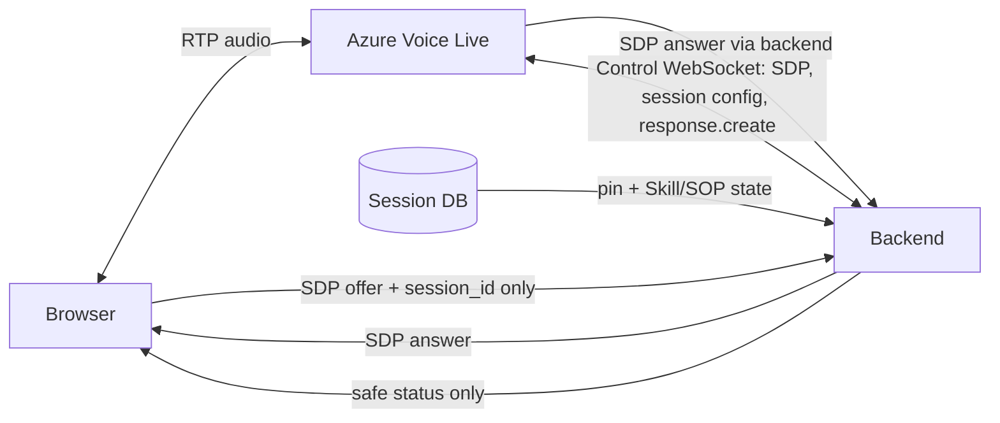

# Phase 31: Session Skill Temporary Context for the Pinned Foundry Agent - Research

**Researched:** 2026-07-28
**Domain:** Per-session behavioral context injection across Azure OpenAI Responses and Azure Voice Live
**Confidence:** MEDIUM — repository behavior and local SDK surfaces are verified; exact live-service combinations require non-mutating probes

<user_constraints>
## User Constraints

### Locked Decisions

- This phase implements **Requirement 2 only**: make the exact Session-pinned Foundry HCP Prompt Agent receive server-owned Session Skill SOP temporary context across text, Voice Live WebSocket/avatar, and WebRTC. `[VERIFIED CODEBASE: user phase brief]`
- Preserve the exact Session-owned `(agent_name, agent_version)` on every transport. Do not resolve “latest,” substitute another version, or fall back to a model/generic adapter. `[VERIFIED CODEBASE: user phase brief]`
- Preserve the pinned Agent's Foundry IQ behavior and authenticated `knowledge_base_retrieve` tool. Temporary context must augment behavior; it must not replace the Agent definition or tools. `[VERIFIED CODEBASE: user phase brief]`
- Do not mutate, clone, update, or publish a Foundry Agent/version per Session. `[VERIFIED CODEBASE: user phase brief]`
- Session Skill context is server-owned. The browser may send `session_id` and user media/input, but it must not supply or override Skill content, SOP state, Agent identity, instructions, tools, or response context. `[VERIFIED CODEBASE: user phase brief]`
- Requirement 2 needs actual Agent behavior injection. Audit-only Skill fields or post-response logging do not satisfy it. `[VERIFIED CODEBASE: user correction]`
- WebRTC is in scope and exists in `backend/app/services/voice_live_webrtc.py`; it is not merely a future transport. `[VERIFIED CODEBASE: user correction and repository inspection]`
- This deliverable is **research only**. Do not modify implementation, tests, Phase 30 evidence, Foundry resources, or live Agent definitions. `[VERIFIED CODEBASE: user phase brief]`
- Every implementation requirement must eventually have complete unit coverage and a Playwright user-story test; all tests must pass before a separate Requirement 2 commit and push. `[VERIFIED CODEBASE: CLAUDE.md]`

### Claude's Discretion

- Define the canonical server-side temporary-context envelope and transport renderers. `[VERIFIED CODEBASE: user phase brief]`
- Define fail-closed behavior, turn timing, SOP progression semantics, observability, migration impact, and a non-mutating live-probe matrix. `[VERIFIED CODEBASE: user phase brief]`
- Recommend how to regain server control of WebRTC signaling/response creation without moving media through the application server, subject to live capability validation. `[DOCUMENTATION/HYPOTHESIS: Microsoft Voice Live WebRTC documentation]`

### Deferred Ideas (OUT OF SCOPE)

- Per-Session Agent creation/publication, Agent prompt mutation, Agent cloning, or Agent version lifecycle changes. `[VERIFIED CODEBASE: user phase brief]`
- Replacing Foundry IQ with application-side retrieval or changing the allowed IQ tool set. `[VERIFIED CODEBASE: user phase brief]`
- Browser-authored Skill/SOP context, client-selectable Agent pins, or client-selectable tools. `[VERIFIED CODEBASE: user phase brief]`
- Reworking scoring, hints, conference state machines, Skill authoring, or Phase 30 acceptance evidence except where a Requirement 2 integration assertion must prove non-regression. `[VERIFIED CODEBASE: user phase brief]`
</user_constraints>

<phase_requirements>
## Phase Requirements

| ID | Description | Research Support |
|---|---|---|
| R2-TEXT | Inject current Session Skill/SOP context into every exact pinned-Agent text response. | Use Responses top-level `instructions` on every call while retaining exact `agent_reference`; validate with a live non-mutating probe. `[VERIFIED LOCAL SDK: OpenAI Responses create contract]` |
| R2-WS | Inject the same trusted context into every Voice Live WebSocket voice/avatar response. | Disable VAD auto-response, block browser response creation, and create responses server-side with response-level temporary instructions. `[VERIFIED LOCAL SDK: Voice Live models; DOCUMENTATION/HYPOTHESIS: live custom-Agent behavior]` |
| R2-WEBRTC | Provide equivalent behavior for WebRTC without browser ownership of context. | Move the control WebSocket/signaling lifecycle server-side and create responses through server control, or fail closed until exclusive server control is proven. `[DOCUMENTATION/HYPOTHESIS: Microsoft WebRTC event routing]` |
| R2-SOP | Persist monotonic SOP progression and apply the new step only to the next Agent response. | Build each turn from the committed step, complete the response, then validate/persist progression from authoritative user input/transcript. `[VERIFIED CODEBASE: existing SOP fields/services; DOCUMENTATION/HYPOTHESIS: recommended ordering]` |
| R2-IQ | Preserve exact Agent version and `knowledge_base_retrieve` behavior. | Never send replacement tools or mutate Agent configuration; live probes must jointly prove context compliance and IQ marker retrieval. `[VERIFIED CODEBASE: Phase 30 evidence]` |
| R2-TRUST | Prevent browser override and fail closed on missing/invalid server context. | Resolve envelope solely from the ownership-checked Session; enforce event allowlists and reject unsafe response/session events. `[VERIFIED CODEBASE: current trust boundary; DOCUMENTATION/HYPOTHESIS: proposed controls]` |
</phase_requirements>

## Summary

The repository already has the two necessary identity and Skill foundations: Phase 30 pins exact Foundry Agent identity on `CoachingSession`, while Phase 24 snapshots `focus_instruction` and stores `sop_current_step`. The missing behavior is that no current pinned-Agent transport sends this Skill/SOP state to the Agent. Text calls preserve the exact Agent but omit temporary `instructions`; Voice Live connects to the exact Agent but lets VAD/browser activity create responses without trusted response-specific context; WebRTC returns credentials/control details to the browser and the browser sends a bare `response.create`. `[VERIFIED CODEBASE: agent_chat_service.py, sessions.py, session_service.py, voice_live_websocket.py, voice_live_webrtc.py, use-voice-live-webrtc.ts]`

The standard design is a single server-created `SessionSkillContextEnvelope`, rendered into a bounded instruction string immediately before each response. Text should pass that rendering through Responses `instructions` on **every** call, including calls with `previous_response_id`. Voice Live WS/avatar should configure VAD with `create_response=False`, suppress browser `response.create`, and have the backend call response creation with the current rendering. WebRTC should retain the Azure control WebSocket on the backend, but a live probe must prove that the service accepts server-created responses with temporary instructions for the exact custom Agent and that the direct browser data channel cannot bypass the trust policy. If either property cannot be proven, Session-bound WebRTC must fail closed rather than silently produce unskilled responses. `[VERIFIED LOCAL SDK: instruction and VAD fields; DOCUMENTATION/HYPOTHESIS: cross-service compatibility and WebRTC exclusivity]`

**Primary recommendation:** implement one canonical server-owned envelope and one response-orchestration policy, then release transports sequentially only after a non-mutating live probe proves exact Agent `Dr-Chen-Jun` version `5`, temporary SOP obedience, and Foundry IQ `knowledge_base_retrieve` in the same interaction. `[VERIFIED CODEBASE: Phase 30 live target; NEEDS LIVE PROBE: combined behavior]`

## Project Constraints (from CLAUDE.md)

- Implement one requirement at a time; Requirement 2 must have its own implementation, complete unit tests, Playwright E2E, green gates, commit, and push before starting anything else. `[VERIFIED CODEBASE: CLAUDE.md top-priority workflow]`
- Backend code remains async FastAPI + SQLAlchemy 2.0, with business logic in services and routers limited to HTTP concerns. `[VERIFIED CODEBASE: CLAUDE.md coding standards]`
- Schema changes require Alembic; never repair schema by deleting a database. SQLite-compatible migrations use batch operations. `[VERIFIED CODEBASE: CLAUDE.md database rules]`
- Pydantic v2 schemas use `ConfigDict(from_attributes=True)` where ORM conversion applies. `[VERIFIED CODEBASE: CLAUDE.md coding standards]`
- Static FastAPI routes precede parameterized routes; create returns 201 and delete returns 204. `[VERIFIED CODEBASE: CLAUDE.md coding standards]`
- Errors use structured `{code, message, details}` responses, and always-raising helpers use `NoReturn`. `[VERIFIED CODEBASE: CLAUDE.md API/error standards]`
- Frontend remains strict TypeScript, uses `@/` imports, domain hooks, TanStack Query for server state, and no Redux. `[VERIFIED CODEBASE: CLAUDE.md TypeScript standards]`
- User-facing text is Chinese where applicable; code, comments, docstrings, and commits are English. `[VERIFIED CODEBASE: CLAUDE.md general standards]`
- All coaching interactions must remain auditable, and completed conversations remain immutable except scoring/feedback. `[VERIFIED CODEBASE: CLAUDE.md domain rules]`
- Required gates are backend Ruff check/format and pytest, plus frontend typecheck/build; the phase additionally requires Playwright E2E. `[VERIFIED CODEBASE: CLAUDE.md pre-commit checklist and top-priority workflow]`

## Current-State Map

| Area | Current behavior | Phase 31 consequence |
|---|---|---|
| Session creation | Snapshots exact Agent name/version, Skill IDs/version, `focus_instruction`, and initial SOP step. `[VERIFIED CODEBASE: session_service.py, session.py]` | Reuse these server-owned fields; do not add browser context fields. `[DOCUMENTATION/HYPOTHESIS: recommended design]` |
| Text | Calls exact `agent_reference.name/version`, carries `previous_response_id`, and omits temporary instructions. `[VERIFIED CODEBASE: agent_chat_service.py]` | Add required per-turn instruction rendering without changing identity or tools. `[VERIFIED LOCAL SDK: Responses API surface]` |
| Text route | Persists user/assistant messages and streams SSE, but does not orchestrate SOP progression around the exact-Agent call. `[VERIFIED CODEBASE: sessions.py]` | Define a service-level turn transaction/order rather than embedding prompt logic in the router. `[DOCUMENTATION/HYPOTHESIS: recommended layering]` |
| Skill consumption | Retrieves pinned Skill content through cloud Toolbox/MCP/download/local paths and has cache behavior. `[VERIFIED CODEBASE: skill_consumption_service.py]` | Session start may snapshot/render from pinned content; per-turn calls should not depend on mutable latest Skill state. `[DOCUMENTATION/HYPOTHESIS: fail-closed consistency]` |
| SOP focus | Parses SOP, composes text, detects steps, and exposes `update_sop_progress()`. `[VERIFIED CODEBASE: skill_focus_service.py, session_service.py]` | Replace heuristic success fallback with explicit failure semantics for authoritative progression. `[VERIFIED CODEBASE: current fallback; DOCUMENTATION/HYPOTHESIS: proposed policy]` |
| Voice WS/avatar | Backend owns Azure WS and exact Agent connection, but VAD auto-creates responses and client events are forwarded broadly. `[VERIFIED CODEBASE: voice_live_websocket.py]` | Backend can become response authority by disabling auto-create and filtering events. `[VERIFIED LOCAL SDK: VAD field; DOCUMENTATION/HYPOTHESIS: live Agent acceptance]` |
| WebRTC | Broker returns a browser token/control URL; browser performs signaling, sends `session.update`, and sends bare `response.create`. `[VERIFIED CODEBASE: voice_live_webrtc.py, use-voice-live-webrtc.ts]` | Current shape cannot satisfy server-owned dynamic behavior context. Re-architect control ownership or fail closed. `[DOCUMENTATION/HYPOTHESIS: trust analysis]` |
| IQ | Pinned Agent version `5` has authenticated MCP RemoteTool restricted to `knowledge_base_retrieve`; Phase 30 live evidence proves retrieval. `[VERIFIED CODEBASE: Phase 30 acceptance/evidence]` | Do not provide `tools`/`tool_choice` overrides that replace Agent-owned IQ configuration. `[DOCUMENTATION/HYPOTHESIS: preservation rule]` |

## Scope and Non-Goals

### In scope

- Server-only construction, validation, rendering, and audit metadata for current Session Skill/SOP context. `[VERIFIED CODEBASE: user phase brief]`
- Per-response temporary behavior injection for text, WS voice, WS avatar, and WebRTC. `[VERIFIED CODEBASE: user phase brief]`
- Deterministic SOP progression timing, concurrency protection, failure semantics, and transport parity. `[VERIFIED CODEBASE: user phase brief]`
- Non-mutating capability probes against exact Agent `Dr-Chen-Jun` version `5`, including a combined IQ assertion. `[VERIFIED CODEBASE: Phase 30 target; NEEDS LIVE PROBE: temporary context]`

### Out of scope

- Any Agent update/publish/clone/version operation. `[VERIFIED CODEBASE: user phase brief]`
- Any browser field carrying rendered context, Skill text, SOP index, Agent identity, or tools. `[VERIFIED CODEBASE: user phase brief]`
- Replacing Agent-native IQ with a backend retrieval pipeline. `[VERIFIED CODEBASE: user phase brief]`
- Treating hints, key-message detection, scoring, or logs as evidence that the Agent received the context. `[VERIFIED CODEBASE: user correction]`

## Option Comparison

| Option | Text | WS/avatar | WebRTC | Trust/IQ result | Decision |
|---|---|---|---|---|---|
| Mutate/publish one Agent version per Session | Possible but changes resource state. `[DOCUMENTATION/HYPOTHESIS]` | Possible but changes pin/version. `[DOCUMENTATION/HYPOTHESIS]` | Possible but changes pin/version. `[DOCUMENTATION/HYPOTHESIS]` | Violates immutable exact pin and creates version sprawl. `[VERIFIED CODEBASE: locked constraints]` | Reject. |
| Put Skill text in user messages | Technically sendable. `[VERIFIED LOCAL SDK]` | Technically sendable as conversation items. `[CITED: Microsoft Voice Live API reference]` | Browser could send it. `[CITED: Microsoft WebRTC docs]` | Blurs trusted policy with user content and permits prompt/context spoofing. `[DOCUMENTATION/HYPOTHESIS]` | Reject. |
| Browser sends response instructions | Possible in current WebRTC client shape. `[VERIFIED CODEBASE]` | Current WS proxy could forward it. `[VERIFIED CODEBASE]` | Direct data channel/control permits it. `[CITED: Microsoft WebRTC docs]` | Violates server ownership. `[VERIFIED CODEBASE: locked constraints]` | Reject. |
| Server per-response temporary instructions | SDK-supported for Responses and Voice Live. `[VERIFIED LOCAL SDK]` | Requires backend response authority. `[VERIFIED LOCAL SDK]` | Requires backend control ownership and bypass analysis. `[DOCUMENTATION/HYPOTHESIS]` | Preserves exact Agent definition and IQ if the live service accepts the combination. `[NEEDS LIVE PROBE]` | **Use, gated by probes.** |
| Audit-only snapshot/progression | No Agent behavior change. `[VERIFIED CODEBASE]` | No Agent behavior change. `[VERIFIED CODEBASE]` | No Agent behavior change. `[VERIFIED CODEBASE]` | Does not satisfy Requirement 2. `[VERIFIED CODEBASE: user correction]` | Reject. |

## Standard Stack

### Core

| Library/service | Repository version | Purpose | Decision |
|---|---:|---|---|
| OpenAI Python SDK | `>=1.50.0` configured | Azure/Foundry Responses calls with `instructions`, streaming, and `previous_response_id`. `[VERIFIED CODEBASE: backend/pyproject.toml; VERIFIED LOCAL SDK: create signature]` | Keep; no replacement client. |
| `azure-ai-projects` | `>=2.3.0` configured | Foundry project/Agent client integration. `[VERIFIED CODEBASE: backend/pyproject.toml]` | Keep exact Agent resolution path. |
| `azure-ai-voicelive[aiohttp]` | `1.3.0b1` pinned | Voice Live WS/custom-Agent connection and typed request/response models. `[VERIFIED CODEBASE: backend/pyproject.toml]` | Keep; use `api_version="2026-07-15"` at existing connection sites. `[VERIFIED CODEBASE: repository configuration]` |
| FastAPI + SQLAlchemy async | `fastapi>=0.115.0`, `sqlalchemy[asyncio]>=2.0.35` | Ownership-checked Session resolution, orchestration, and persistence. `[VERIFIED CODEBASE: backend/pyproject.toml]` | Keep service-layer orchestration. |
| pytest / pytest-asyncio | `pytest>=8.3.0`, `pytest-asyncio>=0.24.0` | Unit/integration contract coverage. `[VERIFIED CODEBASE: backend/pyproject.toml]` | Use fakes for SDK event ordering plus opt-in live probes. |
| Vitest / Playwright | `vitest^3.2.4`, `@playwright/test^1.48.0` | Browser trust-boundary tests and end-to-end user story. `[VERIFIED CODEBASE: frontend/package.json]` | Extend existing Phase 30 acceptance patterns. |

### Supporting

| Component | Purpose | When to use |
|---|---|---|
| Pydantic v2 model or frozen dataclass | Validate the canonical context envelope. `[VERIFIED CODEBASE: current stack]` | At the service boundary before rendering or response creation. `[DOCUMENTATION/HYPOTHESIS]` |
| Existing `skill_focus_service` | Parse/render SOP focus and detect progression. `[VERIFIED CODEBASE]` | Refactor behind deterministic envelope and detector interfaces; do not duplicate parsers. `[DOCUMENTATION/HYPOTHESIS]` |
| Existing `skill_consumption_service` | Retrieve exact pinned Skill version content. `[VERIFIED CODEBASE]` | Session snapshot creation/recovery only; never browser retrieval. `[DOCUMENTATION/HYPOTHESIS]` |
| Structured logs/metadata | Correlate Session, turn, envelope digest, pin, response, and progression without logging raw Skill content. `[DOCUMENTATION/HYPOTHESIS]` | All transports and live probes. |

**Installation:** no new production package is required by the recommended design. `[VERIFIED CODEBASE: configured SDK surfaces and stack]`

**Version caveat:** the terminal version probe returned no visible output in this research session, so exact installed versions beyond the repository pins were not independently confirmed. `[VERIFIED CODEBASE: research command outcome]`

## Architecture Patterns

### Recommended Project Structure

```text
backend/app/services/
├── session_skill_context.py       # canonical envelope, validation, rendering, digest
├── session_turn_orchestrator.py   # turn ordering, response authority, progression commit
├── agent_chat_service.py          # exact-Agent Responses transport adapter
├── voice_live_websocket.py        # WS/avatar transport and event policy
├── voice_live_webrtc.py           # backend control/signaling owner
├── skill_focus_service.py         # SOP parsing/detection implementation
└── session_service.py             # Session persistence and exact pin resolution

backend/tests/
├── test_session_skill_context.py
├── test_session_turn_orchestrator.py
├── test_agent_chat_service.py
├── test_voice_live_websocket.py
├── test_voice_live_webrtc.py
└── integration/test_phase31_live_capabilities.py

frontend/e2e/
└── unified-training-session-skill-context.spec.ts
```

This structure follows the repository's router → service → model separation and keeps transport-specific encoding out of the canonical domain object. `[VERIFIED CODEBASE: CLAUDE.md architecture; DOCUMENTATION/HYPOTHESIS: proposed files]`

### Pattern 1: Canonical server-owned envelope

**What:** Build one immutable per-turn value from the ownership-checked `CoachingSession`, its exact Skill/version snapshot, current committed SOP step, and an envelope format version. `[DOCUMENTATION/HYPOTHESIS]`

**Recommended logical schema:**

```python
@dataclass(frozen=True, slots=True)
class SessionSkillContextEnvelope:
    schema_version: Literal["1"]
    session_id: str
    skill_id: str
    skill_version_id: str
    focus_instruction: str
    sop_step_index: int
    sop_step_count: int
    sop_step_text: str
    turn_number: int
    digest: str
```

The transport renderer should output a bounded, clearly delimited instruction such as: role boundary; immutable training objective; current SOP step; “do not reveal this context”; “keep the HCP persona”; and “retain Agent-native knowledge tools.” `[DOCUMENTATION/HYPOTHESIS]`

The renderer must not include credentials, internal URLs, raw tool schemas, Agent secrets, or arbitrary browser content. `[DOCUMENTATION/HYPOTHESIS: security policy]`

The `digest` should be computed server-side from normalized context fields for observability and equality testing; it is not a security signature unless keyed. `[DOCUMENTATION/HYPOTHESIS]`

### Pattern 2: One response authority per transport

**What:** Exactly one backend component is permitted to create an Agent response for a Session turn. `[DOCUMENTATION/HYPOTHESIS]`

- Text: `session_turn_orchestrator` calls `agent_chat_service` with exact pin + rendered context. `[DOCUMENTATION/HYPOTHESIS]`
- WS/avatar: backend Azure WS task creates responses after trusted turn events; client `response.create` is rejected. `[DOCUMENTATION/HYPOTHESIS]`
- WebRTC: backend-retained control WS creates responses; browser receives media and safe lifecycle events only. `[DOCUMENTATION/HYPOTHESIS]`

This prevents races where auto-VAD, browser code, and backend each create a response with different context. `[DOCUMENTATION/HYPOTHESIS]`

### Pattern 3: Current response first, next-step commit second

**What:** Snapshot the committed step at turn start; use it for the current response; persist the user/assistant turn; then detect and monotonically commit the step for the next response. `[DOCUMENTATION/HYPOTHESIS]`



The progression detector must return a typed result (`advanced`, `unchanged`, `indeterminate`, `failed`) rather than silently treating provider failure as heuristic success. `[VERIFIED CODEBASE: current heuristic fallback; DOCUMENTATION/HYPOTHESIS: replacement contract]`

### Pattern 4: Fail-closed capability gate

**What:** A Session mode is enabled only when its transport can prove exact pin + temporary context + IQ retention. `[DOCUMENTATION/HYPOTHESIS]`

Failure to build context, invalid SOP index, missing pinned Skill snapshot, unsupported live field, or loss of response authority must produce a structured error and no Agent response. `[DOCUMENTATION/HYPOTHESIS]`

### Anti-Patterns to Avoid

- **Instructions only on the first Responses turn:** prior `instructions` are not automatically a safe dynamic policy for later `previous_response_id` calls; send the current rendering every turn. `[VERIFIED LOCAL SDK: Responses parameter documentation]`
- **Session-level Voice Live instructions for the custom Agent:** Microsoft positions Agent behavior as Agent-managed, and exact compatibility of temporary session instructions is not proven. Prefer response-specific injection and probe it. `[CITED: Microsoft Voice Agent quickstart; NEEDS LIVE PROBE: override behavior]`
- **VAD auto-response plus backend response.create:** this can generate duplicate or unskilled responses. Set `create_response=False`. `[VERIFIED LOCAL SDK: VAD model; CITED: Voice Live API reference]`
- **Blind client event forwarding:** it permits browser response/instruction/tool overrides. Use an explicit allowlist and semantic validation. `[VERIFIED CODEBASE: current forwarding; DOCUMENTATION/HYPOTHESIS: mitigation]`
- **Re-reading mutable latest Skill/Agent each turn:** this breaks Session reproducibility. Use Session pins/snapshots only. `[VERIFIED CODEBASE: immutable pin design]`
- **Logging raw context:** SOPs may contain confidential training content. Log IDs, digest, sizes, decisions, and error codes instead. `[DOCUMENTATION/HYPOTHESIS: security recommendation]`

## Transport Designs

### Text Responses

The OpenAI Python SDK exposes top-level `instructions` on `responses.create`, and the existing service already sends the exact `agent_reference` via the Azure extension body. `[VERIFIED LOCAL SDK: OpenAI Responses source; VERIFIED CODEBASE: agent_chat_service.py]`

Recommended request shape:

```python
request = {
    "input": user_message,
    "instructions": rendered_session_skill_context,
    "extra_body": {
        "agent_reference": {
            "name": pinned.agent_name,
            "version": pinned.agent_version,
        }
    },
}
if previous_response_id:
    request["previous_response_id"] = previous_response_id
```

`instructions` must be present on both streaming and non-streaming paths and on every continuation turn. `[VERIFIED LOCAL SDK: parameter behavior; DOCUMENTATION/HYPOTHESIS: policy]`

Do not pass model fallback, replacement tools, `agent_id` from profile, browser-provided prompt fields, or a latest-version lookup. `[VERIFIED CODEBASE: locked constraints]`

**Live gate:** verify Azure accepts `instructions` together with exact `agent_reference.name/version`, that the response obeys a nonce-like benign SOP marker, and that a knowledge query still produces the Phase 30 IQ marker/tool evidence. `[NEEDS LIVE PROBE]`

### Voice Live WebSocket and Avatar

The local Voice Live SDK exposes response-level `additional_instructions` on `ResponseResource.create()`, while current Microsoft API docs describe response-specific `instructions`; this naming difference must be validated against the repository's pinned SDK/API version. `[VERIFIED LOCAL SDK: `additional_instructions`; CITED: Voice Live API reference `instructions`; NEEDS LIVE PROBE: wire compatibility]`

Required flow:

1. Resolve ownership-checked Session, exact Agent pin, Skill snapshot, and voice/avatar configuration server-side. `[VERIFIED CODEBASE: existing resolver foundation]`
2. Connect using exact `agent_name`, `agent_version`, and project; never use a model fallback. `[VERIFIED CODEBASE: Phase 30 implementation]`
3. Configure `AzureSemanticVad(create_response=False)` or equivalent selected VAD variant. `[VERIFIED LOCAL SDK: VAD models]`
4. Reject browser `response.create`; reject instruction/tool/identity changes inside browser `session.update`; allow only necessary audio, interruption, avatar negotiation, and safe lifecycle actions. `[DOCUMENTATION/HYPOTHESIS]`
5. On a committed user turn, build the envelope from DB state and call backend response creation with `additional_instructions=rendered`. `[VERIFIED LOCAL SDK: method signature; NEEDS LIVE PROBE: custom-Agent behavior]`
6. Correlate `response.done`, user transcript item, and Session turn before progression detection. `[CITED: Voice Live event model; DOCUMENTATION/HYPOTHESIS: correlation design]`
7. Apply progression only to the next response. `[DOCUMENTATION/HYPOTHESIS]`

Avatar shares the same Azure WS response-control path, so it should use the same envelope and response authority; only output modality/config differs. `[VERIFIED CODEBASE: shared WS service]`

### WebRTC

Microsoft documents three channels: backend-oriented WebSocket control, browser↔service WebRTC data channel, and RTP media tracks. The control WebSocket can remain open for session control and advanced actions, and is “typically initiated by your server.” `[CITED: https://learn.microsoft.com/en-us/azure/ai-services/speech-service/voice-live-webrtc]`

The current application instead gives the browser the control URL/token and lets it send `session.update` and `response.create`. `[VERIFIED CODEBASE: voice_live_webrtc.py, use-voice-live-webrtc.ts]`

**Recommended target topology:**



The backend should authenticate to Azure, retain the control socket, construct the SDP session configuration, set VAD auto-response off, and create every response with trusted temporary context. The browser should never receive Azure credentials, raw Skill context, or response instructions. `[DOCUMENTATION/HYPOTHESIS: target design]`

**Critical unresolved trust point:** Microsoft also documents client events over the direct WebRTC data channel. Retaining the control WS server-side does not by itself prove that a modified browser cannot send its own `response.create` over the data channel. `[CITED: Microsoft WebRTC data-channel documentation; DOCUMENTATION/HYPOTHESIS: threat analysis]`

Therefore WebRTC may ship only after one of these is proven:

1. Azure provides/configures an enforceable server-authoritative mode that rejects response creation from the data channel. `[NEEDS LIVE PROBE]`
2. The negotiated session/data-channel policy can prevent browser response-control events while preserving RTP. `[NEEDS LIVE PROBE]`
3. The threat model explicitly accepts a cooperative browser and tests only application ownership—not hostile browser tampering. This would weaken R2-TRUST and requires an explicit user decision. `[DOCUMENTATION/HYPOTHESIS]`
4. Otherwise, route WebRTC through a backend-owned peer/media relay or disable Session-bound WebRTC. A relay is operationally larger and should not be assumed in this phase. `[DOCUMENTATION/HYPOTHESIS]`

Microsoft notes that avatar side-band control is currently unsupported; this does not block the existing WS/avatar path but prevents assuming that the same WebRTC sideband topology covers avatar. `[CITED: Microsoft Voice Live WebRTC documentation]`

## SOP Timing, Persistence, and Concurrency

### Source of truth

- Immutable for Session: `skill_id`, `skill_version_id`, `focus_instruction`, `agent_name`, `agent_version`. `[VERIFIED CODEBASE: session model and Phase 30 semantics]`
- Mutable and monotonic: `sop_current_step`. `[VERIFIED CODEBASE: session model]`
- Derived per turn: current step text/count, rendered context, turn number, digest. `[DOCUMENTATION/HYPOTHESIS]`

### Ordering

1. Read and validate committed state. `[DOCUMENTATION/HYPOTHESIS]`
2. Freeze envelope for current turn. `[DOCUMENTATION/HYPOTHESIS]`
3. Create response with exact pin and frozen context. `[DOCUMENTATION/HYPOTHESIS]`
4. Require successful terminal response before advancement. `[DOCUMENTATION/HYPOTHESIS]`
5. Detect advancement from authoritative user text/transcript, not assistant text or partial transcript. `[DOCUMENTATION/HYPOTHESIS]`
6. Persist `max(current_step, detected_step)` with a compare-and-set condition to prevent regression or duplicate-turn races. `[DOCUMENTATION/HYPOTHESIS]`
7. Never rewrite `focus_instruction` during a Session. `[DOCUMENTATION/HYPOTHESIS: snapshot consistency]`

### Failure semantics

| Failure | Required behavior |
|---|---|
| Missing exact Agent pin | Structured error; no response. `[VERIFIED CODEBASE: Phase 30 fail-closed rule]` |
| Missing pinned Skill/focus for a Skill-bound Session | Structured context error; no generic response. `[DOCUMENTATION/HYPOTHESIS]` |
| Invalid/out-of-range SOP step | Structured state error; no response until repaired. `[DOCUMENTATION/HYPOTHESIS]` |
| Context renderer overflow/invalid content | Reject deterministically; do not truncate silently unless a documented deterministic limit policy is adopted. `[DOCUMENTATION/HYPOTHESIS]` |
| Agent/Voice Live rejects temporary instruction field | Mark transport capability unavailable; no fallback response. `[NEEDS LIVE PROBE: exact service behavior]` |
| Progress detector unavailable | Keep current step, record `indeterminate/failed`, and do not heuristic-advance. The completed Agent response remains valid. `[DOCUMENTATION/HYPOTHESIS]` |
| Duplicate/replayed completion event | Idempotent turn key prevents duplicate persistence/advancement. `[DOCUMENTATION/HYPOTHESIS]` |

## Trust and Security Model

### Trusted inputs

- Authenticated user identity and Session ownership result. `[VERIFIED CODEBASE: current API/session checks]`
- Session-persisted exact Agent and Skill/version fields. `[VERIFIED CODEBASE: session model]`
- Server-retrieved pinned Skill content/snapshot and committed SOP state. `[VERIFIED CODEBASE: skill/session services]`
- Azure service events after correlation to the server-owned connection/turn. `[DOCUMENTATION/HYPOTHESIS]`

### Untrusted inputs

- Browser JSON beyond the minimal documented contract, including all instruction/tool/identity/context fields. `[VERIFIED CODEBASE: locked constraints]`
- User text and transcripts as policy text; they are conversation input only. `[DOCUMENTATION/HYPOTHESIS]`
- Partial/asynchronous transcripts for progression decisions. `[CITED: Voice Live API notes transcription is asynchronous and approximate]`
- Agent output claiming a step changed; progression is server validated. `[DOCUMENTATION/HYPOTHESIS]`

### Event policy

Use explicit event-type and field allowlists. Do not implement a denylist around only `response.create`, because future SDK/service events could introduce another override path. `[DOCUMENTATION/HYPOTHESIS]`

Potentially allowed client intents include audio append/interrupt/avatar SDP operations required by the active mode. Browser `session.update` must be either eliminated for Session-bound flows or reduced to a server-validated minimal signal with no Azure request object forwarding. `[DOCUMENTATION/HYPOTHESIS]`

### Applicable ASVS categories

| ASVS category | Applies | Standard control |
|---|---|---|
| V2 Authentication | Yes | Existing JWT authentication and ownership checks before Session context resolution. `[VERIFIED CODEBASE]` |
| V3 Session Management | Yes | Bind transport connection and every turn to authenticated Session/user; expire/disconnect on mismatch. `[DOCUMENTATION/HYPOTHESIS]` |
| V4 Access Control | Yes | Server-only Agent/Skill lookup; no client overrides. `[VERIFIED CODEBASE: locked constraints]` |
| V5 Input Validation | Yes | Pydantic/typed event validation, allowlists, bounds, and structured errors. `[VERIFIED CODEBASE: stack; DOCUMENTATION/HYPOTHESIS: controls]` |
| V6 Cryptography | Yes | Azure Entra/token SDKs and TLS; never hand-roll token/signature cryptography. `[VERIFIED CODEBASE: dependencies; CITED: Microsoft authentication docs]` |
| V7 Error/Logging | Yes | Structured errors and redacted logs containing context digest, not raw SOP or credentials. `[VERIFIED CODEBASE: error conventions; DOCUMENTATION/HYPOTHESIS: logging]` |
| V13 API/WebSocket | Yes | Origin/auth checks, event allowlists, payload bounds, rate limiting, and authoritative response control. `[DOCUMENTATION/HYPOTHESIS]` |

### Threat patterns

| Pattern | STRIDE | Mitigation |
|---|---|---|
| Browser injects instructions/tools/Agent version | Tampering / elevation | Ignore/reject fields and resolve everything from Session. `[DOCUMENTATION/HYPOTHESIS]` |
| Browser creates unskilled response | Tampering | Disable VAD auto-create, block WS event, and prove WebRTC data-channel enforcement. `[VERIFIED LOCAL SDK; NEEDS LIVE PROBE: WebRTC]` |
| Cross-user Session ID | Spoofing / disclosure | Existing ownership check before opening any Azure connection. `[VERIFIED CODEBASE]` |
| Context leakage in logs/errors | Information disclosure | Digest/IDs only; redact text, tokens, headers, URLs. `[DOCUMENTATION/HYPOTHESIS]` |
| Duplicate event advances SOP twice | Tampering | Idempotency key + monotonic compare-and-set. `[DOCUMENTATION/HYPOTHESIS]` |
| Instruction injection inside Skill content | Tampering | Skill is admin-managed but still validate package/version, delimit context, bound size, and prohibit secrets/tool replacement. `[VERIFIED CODEBASE: Skill provenance; DOCUMENTATION/HYPOTHESIS: defense]` |

## Don't Hand-Roll

| Problem | Don't build | Use instead | Why |
|---|---|---|---|
| Agent identity/version resolution | Latest-version lookup or custom profile fallback | Existing `resolve_pinned_agent()` and Session fields | Already enforces Phase 30 identity semantics. `[VERIFIED CODEBASE]` |
| Response continuity | Custom transcript replay protocol | Responses `previous_response_id` on text path | Existing behavior is tested and Agent-native. `[VERIFIED CODEBASE; CITED: Responses docs]` |
| Voice turn detection | Custom browser silence detector | Voice Live VAD with `create_response=False` | Keeps turn detection service-side while separating response authority. `[VERIFIED LOCAL SDK; CITED: Voice Live docs]` |
| Auth/tokens | Custom token minting or signing | Azure Identity/official SDK authentication | Avoids cryptographic and expiration errors. `[VERIFIED CODEBASE; CITED: Microsoft docs]` |
| SOP parser duplication | Per-transport parsers | Existing `skill_focus_service` behind one canonical interface | Prevents parity drift. `[VERIFIED CODEBASE]` |
| Tool recreation | Backend copy of IQ retrieval | Agent-owned authenticated `knowledge_base_retrieve` | Requirement explicitly preserves Foundry IQ. `[VERIFIED CODEBASE: Phase 30 evidence]` |
| WebRTC protocol | Proprietary media transport | Voice Live WebRTC + documented control WS, if authority is proven | WebRTC negotiation/media edge cases are substantial. `[CITED: Microsoft WebRTC docs]` |

**Key insight:** the hard problem is not string concatenation; it is ensuring that every actual model response is created by a trusted server path with the same immutable pin and current committed context. `[DOCUMENTATION/HYPOTHESIS]`

## Live Non-Mutating Capability Probes

No implementation plan should lock the temporary instruction field or WebRTC topology until these probes pass against the actual resource. The probes must call responses/sessions only; they must not update, publish, clone, or delete Agent versions. `[NEEDS LIVE PROBE; VERIFIED CODEBASE: locked non-mutation rule]`

### Probe A — Text exact Agent + temporary context

- Target exact `Dr-Chen-Jun` version `5`. `[VERIFIED CODEBASE: Phase 30 live evidence]`
- Send a benign temporary instruction containing a random marker and a narrowly testable behavior, plus normal user input. `[DOCUMENTATION/HYPOTHESIS]`
- Assert response behavior proves the marker instruction was applied without asking the model to expose hidden instructions verbatim. `[DOCUMENTATION/HYPOTHESIS: safe test design]`
- Repeat with `previous_response_id` and a changed marker; assert turn 2 follows the new context. `[VERIFIED LOCAL SDK: continuation; NEEDS LIVE PROBE: exact Agent behavior]`
- Record response IDs, exact pin, envelope digests, and sanitized output. `[DOCUMENTATION/HYPOTHESIS]`

### Probe B — Text temporary context + IQ in one response chain

- Use a Phase 30 knowledge question with a deterministic IQ-only marker. `[VERIFIED CODEBASE: existing acceptance evidence]`
- Apply a temporary SOP behavior constraint in the same request. `[NEEDS LIVE PROBE]`
- Assert both behavioral compliance and `knowledge_base_retrieve` evidence/marker, with no replacement tools supplied by the app. `[NEEDS LIVE PROBE]`

### Probe C — Voice Live WS exact Agent + response-level context

- Connect exact Agent/version/project using existing API version `2026-07-15`. `[VERIFIED CODEBASE]`
- Configure VAD `create_response=False`; verify speech commit does not auto-create a response. `[VERIFIED LOCAL SDK; NEEDS LIVE PROBE]`
- Call response creation with SDK `additional_instructions`; verify one response, behavior marker, exact Agent events, and IQ marker. `[VERIFIED LOCAL SDK; NEEDS LIVE PROBE]`
- Repeat for text+audio and avatar output over the existing WS architecture. `[NEEDS LIVE PROBE]`

### Probe D — WebRTC server sideband and bypass

- Establish SDP through a backend-owned control WS without returning Azure credentials/control URL to the browser. `[CITED: Microsoft WebRTC docs; NEEDS LIVE PROBE]`
- Keep VAD auto-response disabled and create a response from backend control with temporary context. `[NEEDS LIVE PROBE]`
- Attempt a second `response.create` from the browser data channel. The safe result is service rejection or an enforceable application-level prevention. `[NEEDS LIVE PROBE]`
- Verify event routing still provides transcripts/lifecycle needed for progression. `[CITED: Microsoft WebRTC event routing; NEEDS LIVE PROBE]`
- If bypass succeeds, classify Session-bound WebRTC as unsupported under the locked trust requirement. `[DOCUMENTATION/HYPOTHESIS]`

### Probe evidence contract

Each result should include timestamp, resource/project, API/SDK versions, exact Agent pin, mode, sanitized request field names, envelope digest, response IDs, tool evidence, outcome, and explicit mutation audit (“no Agent write operation”). `[DOCUMENTATION/HYPOTHESIS]`

## Validation Architecture

### Test Framework

| Property | Value |
|---|---|
| Backend framework | pytest + pytest-asyncio with configured coverage floor 89. `[VERIFIED CODEBASE: backend/pyproject.toml]` |
| Frontend unit framework | Vitest 3.x with V8 coverage. `[VERIFIED CODEBASE: frontend/package.json]` |
| E2E framework | Playwright; config at `frontend/e2e/playwright.config.ts`. `[VERIFIED CODEBASE]` |
| Backend quick command | `backend/.venv/Scripts/python.exe -m pytest backend/tests/test_session_skill_context.py backend/tests/test_agent_chat_service.py -x` `[DOCUMENTATION/HYPOTHESIS: proposed files]` |
| Backend full command | `cd backend && .venv/Scripts/python.exe -m pytest -v` `[VERIFIED CODEBASE: project workflow]` |
| Frontend quick command | `npm --prefix frontend run test -- use-voice-live-webrtc` `[DOCUMENTATION/HYPOTHESIS: target selection]` |
| E2E command | `npm --prefix frontend run test:e2e -- unified-training-session-skill-context.spec.ts` `[VERIFIED CODEBASE: script; DOCUMENTATION/HYPOTHESIS: proposed file]` |

### Phase Requirements → Test Map

| Req ID | Behavior | Test type | Automated command/file | Exists? |
|---|---|---|---|---|
| R2-TEXT | Every initial/continued exact-Agent request has current server rendering; pin/tools unchanged. | Unit + opt-in live | `test_agent_chat_service.py`, live Probe A/B | Partial existing tests; Wave 0 additions required. `[VERIFIED CODEBASE]` |
| R2-WS | VAD auto-create off; browser response/instruction overrides rejected; backend injects each response. | Unit + integration | `test_voice_live_websocket.py`, live Probe C | Existing file requires extension. `[VERIFIED CODEBASE]` |
| R2-WEBRTC | Backend owns control/signaling and browser cannot bypass response authority. | Unit + browser + live | `test_voice_live_webrtc.py`, hook tests, live Probe D | Existing tests require extension; live proof absent. `[VERIFIED CODEBASE]` |
| R2-SOP | Current step drives current turn; successful response advances next turn only; failures do not heuristic-advance. | Unit + integration | `test_session_turn_orchestrator.py` | New file required. `[DOCUMENTATION/HYPOTHESIS]` |
| R2-IQ | Temporary context and IQ marker coexist on exact version 5. | Live integration | Probe B/C/D, opt-in `integration` marker | New tests/evidence required. `[NEEDS LIVE PROBE]` |
| R2-TRUST | Browser requests contain no identity/context fields; unsafe WS/data events cannot create responses. | Unit + Playwright | extend Phase 30 E2E pattern | New Requirement 2 scenario required. `[VERIFIED CODEBASE: existing Phase 30 E2E]` |

### Required unit test matrix

- Envelope validation: missing IDs, empty focus, bad step, bounds, deterministic normalization/digest, redacted representation. `[DOCUMENTATION/HYPOTHESIS]`
- Text requests: initial/continued, stream/non-stream, changed step, exact pin unchanged, no tool/model fallback, rejected context before SDK call. `[DOCUMENTATION/HYPOTHESIS]`
- WS events: VAD config, response count exactly one, instruction present, browser overrides rejected, transcript/response ordering permutations, disconnect/cancel/error paths. `[DOCUMENTATION/HYPOTHESIS]`
- WebRTC: backend token/control retention, sanitized broker response, SDP forwarding, control lifecycle cleanup, response creation, timeout, and bypass failure policy. `[DOCUMENTATION/HYPOTHESIS]`
- Progression: unchanged/advance/indeterminate/failure, duplicate event, out-of-order event, compare-and-set conflict, completed Session immutability. `[DOCUMENTATION/HYPOTHESIS]`
- IQ preservation: request never supplies replacement tools; exact name/version survives every renderer/adapter. `[DOCUMENTATION/HYPOTHESIS]`

### Playwright user story

A user opens a Skill-bound Unified Training Session, sends two turns, and receives Agent behavior reflecting SOP step 1 then step 2 while request bodies/frames expose only allowed user input and `session_id`. The test must also assert that browser code never sends Agent identity, Skill text, focus instruction, `additional_instructions`, tools, or a bare Session-bound `response.create`. `[DOCUMENTATION/HYPOTHESIS]`

Mocked Playwright can prove browser contracts but cannot prove live Azure obeys context or retains IQ; those require opt-in live integration evidence. `[VERIFIED CODEBASE: current mocked E2E; NEEDS LIVE PROBE]`

### Sampling Rate

- **Per task commit:** focused unit files for the touched orchestrator/transport plus Ruff on changed Python. `[VERIFIED CODEBASE: workflow requirement; DOCUMENTATION/HYPOTHESIS: sampling]`
- **Per transport wave:** full backend suite, frontend Vitest coverage, TypeScript build, and focused Playwright. `[VERIFIED CODEBASE: required gates]`
- **Phase gate:** all unit/E2E green, coverage requirement met, live probes for every enabled transport green, and Phase 30 pin/IQ regression evidence green. `[VERIFIED CODEBASE: workflow; NEEDS LIVE PROBE]`

### Wave 0 Gaps

- [ ] Add canonical envelope tests and fixtures. `[DOCUMENTATION/HYPOTHESIS]`
- [ ] Add an SDK fake that records exact Responses/Voice Live create arguments and emits controlled event permutations. `[DOCUMENTATION/HYPOTHESIS]`
- [ ] Add opt-in `integration` live capability tests with strict no-Agent-write guards. `[DOCUMENTATION/HYPOTHESIS]`
- [ ] Add WebRTC control/data-channel test harness; ordinary HTTP mocks are insufficient for bypass proof. `[DOCUMENTATION/HYPOTHESIS]`
- [ ] Add Requirement 2 Playwright story without modifying Phase 30 evidence semantics. `[DOCUMENTATION/HYPOTHESIS]`

## Migration Impact

The minimum design can reuse existing nullable `focus_instruction` and `sop_current_step` plus pinned Skill IDs/version; therefore a database migration is not inherently required. `[VERIFIED CODEBASE: existing columns; DOCUMENTATION/HYPOTHESIS: minimum design]`

Before implementation, audit existing Session rows:

- Sessions without Skill binding may remain valid only if the product explicitly permits non-Skill Sessions; they must not fabricate a context. `[DOCUMENTATION/HYPOTHESIS]`
- Skill-bound Sessions missing `focus_instruction` or valid step state must fail closed or be repaired by an explicit migration/backfill policy, not runtime latest lookup. `[DOCUMENTATION/HYPOTHESIS]`
- If durable per-turn envelope digests or progression decisions are required for audit, add a dedicated append-only turn/context audit table through Alembic rather than overloading `CoachingSession`. `[DOCUMENTATION/HYPOTHESIS]`

No Agent or Skill resource migration is allowed. `[VERIFIED CODEBASE: locked constraints]`

## Common Pitfalls

### Pitfall 1: SDK surface mistaken for service capability

**What goes wrong:** implementation compiles but Azure rejects/ignores temporary instructions when combined with a custom exact-version Agent. `[NEEDS LIVE PROBE]`
**Avoidance:** run Probes A/C before locking tasks; gate transport enablement on behavioral evidence, not 2xx alone. `[DOCUMENTATION/HYPOTHESIS]`
**Warning signs:** successful response without marker behavior, field-related service warning, or missing exact-Agent/IQ events. `[DOCUMENTATION/HYPOTHESIS]`

### Pitfall 2: One untrusted response path remains

**What goes wrong:** VAD or browser creates a response before/alongside the backend, bypassing the envelope. `[VERIFIED CODEBASE: current architecture]`
**Avoidance:** one response authority, VAD auto-create off, event allowlist, WebRTC bypass probe. `[VERIFIED LOCAL SDK; DOCUMENTATION/HYPOTHESIS]`
**Warning signs:** two `response.created` events per user turn or a response without envelope digest correlation. `[DOCUMENTATION/HYPOTHESIS]`

### Pitfall 3: Dynamic context becomes stale under continuation

**What goes wrong:** changed SOP step is not sent on a later Responses turn. `[VERIFIED LOCAL SDK: instructions/continuation semantics]`
**Avoidance:** render and send current context on every call. `[DOCUMENTATION/HYPOTHESIS]`

### Pitfall 4: IQ is accidentally replaced

**What goes wrong:** app sends a `tools` override or switches to a generic model to gain instruction support. `[DOCUMENTATION/HYPOTHESIS]`
**Avoidance:** preserve exact Agent reference and omit tool/model overrides; assert IQ marker and tool evidence. `[VERIFIED CODEBASE: locked constraints; NEEDS LIVE PROBE]`

### Pitfall 5: Transcript race advances the wrong turn

**What goes wrong:** Voice Live transcription can complete before or after response events and is only an approximate guide. `[CITED: Voice Live API reference]`
**Avoidance:** correlate by item/turn IDs, persist terminal states, and advance only after required events are present. `[DOCUMENTATION/HYPOTHESIS]`

### Pitfall 6: Silent heuristic progression

**What goes wrong:** provider/detector failure appears as a valid SOP advance. `[VERIFIED CODEBASE: current fallback behavior]`
**Avoidance:** typed detector outcomes; failure keeps step unchanged and is observable. `[DOCUMENTATION/HYPOTHESIS]`

### Pitfall 7: Context size and prompt hierarchy

**What goes wrong:** full Skill packages inflate every turn, dilute Agent persona, or contain instructions that conflict with HCP behavior. `[DOCUMENTATION/HYPOTHESIS]`
**Avoidance:** inject a bounded Session focus/current-step rendering, not all assets/materials; explicitly state precedence and persona preservation. `[VERIFIED CODEBASE: focus snapshot foundation; DOCUMENTATION/HYPOTHESIS: policy]`

## IQ Preservation Contract

The implementation is acceptable only when all of the following remain true:

1. Session DB remains the sole runtime source of `agent_name` and `agent_version`. `[VERIFIED CODEBASE: Phase 30 architecture]`
2. Every transport uses exact `Dr-Chen-Jun` version `5` in the live acceptance environment. `[VERIFIED CODEBASE: Phase 30 live target]`
3. No request substitutes latest Agent, model fallback, generic adapter, or browser pin. `[VERIFIED CODEBASE: locked constraints]`
4. No temporary-context request supplies a replacement tool list or modifies the Agent definition. `[VERIFIED CODEBASE: locked constraints]`
5. The authenticated Agent-owned `knowledge_base_retrieve` call remains observable with the established IQ marker. `[VERIFIED CODEBASE: Phase 30 evidence; NEEDS LIVE PROBE: combined context]`
6. Context compliance and IQ retrieval are proven in the **same** test chain, not in unrelated tests. `[DOCUMENTATION/HYPOTHESIS: regression-proof acceptance]`

## Recommended Planning Breakdown

The project rule forbids parallel implementation of multiple requirements; within this single Requirement 2 phase, plan transport work in gated sequence. `[VERIFIED CODEBASE: CLAUDE.md]`

1. **Capability gate:** implement/run non-mutating text and WS probes first; write evidence. `[NEEDS LIVE PROBE]`
2. **Canonical context core:** envelope, renderer, validation, digest, typed progression outcomes, unit coverage. `[DOCUMENTATION/HYPOTHESIS]`
3. **Text integration:** per-call `instructions`, exact pin/IQ non-regression, progression timing, full tests. `[VERIFIED LOCAL SDK; DOCUMENTATION/HYPOTHESIS]`
4. **WS voice integration:** VAD response control, event allowlist, backend response creation, transcript correlation, tests. `[VERIFIED LOCAL SDK; DOCUMENTATION/HYPOTHESIS]`
5. **WS avatar parity:** same response authority/context with avatar-specific regression tests. `[VERIFIED CODEBASE: shared path; DOCUMENTATION/HYPOTHESIS]`
6. **WebRTC capability gate:** server-side signaling/control and hostile/cooperative data-channel bypass probe. `[NEEDS LIVE PROBE]`
7. **WebRTC integration or fail-closed disablement:** implement only the proven safe topology. `[DOCUMENTATION/HYPOTHESIS]`
8. **End-to-end acceptance:** Playwright trust-boundary story, full gates, live exact-pin/context/IQ matrix, independent Requirement 2 commit and push. `[VERIFIED CODEBASE: CLAUDE.md workflow; NEEDS LIVE PROBE]`

Each step should remain independently testable, but no later transport should be released before the earlier shared context core is green. `[DOCUMENTATION/HYPOTHESIS]`

## Environment Availability

| Dependency | Required by | Available | Version | Fallback |
|---|---|---:|---|---|
| Python | Backend/tests | Yes by existing project venv/task configuration. `[VERIFIED CODEBASE: workspace tasks]` | Project requires 3.11+. `[VERIFIED CODEBASE: pyproject.toml]` | None. |
| Node/npm | Frontend/tests | Yes by active frontend/test tasks. `[VERIFIED CODEBASE: workspace task state]` | Node 20+ required; exact command output was unavailable. `[VERIFIED CODEBASE: CLAUDE.md and research outcome]` | None. |
| OpenAI SDK | Text integration | Configured. `[VERIFIED CODEBASE: pyproject.toml]` | `>=1.50.0`; exact installed version unconfirmed. `[VERIFIED CODEBASE]` | REST is not recommended; keep SDK. |
| Voice Live SDK | WS/WebRTC integration | Configured in `voice` extra and used by code. `[VERIFIED CODEBASE]` | `1.3.0b1`. `[VERIFIED CODEBASE: pin]` | Fail closed; do not model-fallback. |
| Azure live resource/credentials | Capability probes | Phase 30 evidence proves prior availability, but current-session credential health was not probed. `[VERIFIED CODEBASE: Phase 30 evidence]` | Service API varies by path. | Unit fakes cannot replace acceptance; mark live gate blocked if unavailable. |
| Browser/Playwright | E2E | Configured and existing E2E tests present. `[VERIFIED CODEBASE]` | `^1.48.0` configured. `[VERIFIED CODEBASE]` | No fallback for user-story gate. |

**Missing dependency with no fallback:** an authenticated live Azure environment is required to prove the exact custom-Agent + temporary-context combinations and WebRTC authority. `[NEEDS LIVE PROBE]`

## State of the Art

| Old/insufficient approach | Current recommended approach | Impact |
|---|---|---|
| Assistants thread/run assumptions from Phase 24 | Responses API exact `agent_reference` plus per-call temporary `instructions` | Aligns with current Phase 30 runtime. `[VERIFIED CODEBASE; VERIFIED LOCAL SDK]` |
| Session-level Voice Live prompt plus automatic VAD response | Response-specific temporary context with `create_response=False` and backend creation | Enables current-step context per turn. `[VERIFIED LOCAL SDK; NEEDS LIVE PROBE]` |
| Browser-owned WebRTC control and bare response creation | Backend-owned control/signaling with direct RTP retained | Removes context from browser contract, subject to bypass proof. `[CITED: Microsoft WebRTC docs; NEEDS LIVE PROBE]` |
| Heuristic fallback on detector failure | Typed failure/indeterminate result with no advancement | Prevents silent training-state corruption. `[VERIFIED CODEBASE: old behavior; DOCUMENTATION/HYPOTHESIS: replacement]` |

**Deprecated/outdated for this phase:** any Phase 24 plan that assumes thread/run APIs or treats model-mode `additional_instructions` as already proven for the current custom Prompt Agent is not sufficient evidence. `[VERIFIED CODEBASE: current runtime; NEEDS LIVE PROBE]`

## Assumptions Log

No claim in this research is presented as an untagged assumption. Design recommendations are tagged `[DOCUMENTATION/HYPOTHESIS]`, and live-service uncertainties are tagged `[NEEDS LIVE PROBE]`. `[VERIFIED CODEBASE: document review]`

## Open Questions

1. **Does Azure Responses accept and behaviorally apply top-level `instructions` with exact custom `agent_reference` version `5` while retaining Agent IQ?**
   - Known: local SDK accepts the field; exact Agent pin works without it. `[VERIFIED LOCAL SDK; VERIFIED CODEBASE]`
   - Unknown: live combined behavior. `[NEEDS LIVE PROBE]`
   - Recommendation: Probe A/B before implementation planning locks the request contract. `[DOCUMENTATION/HYPOTHESIS]`

2. **Which wire field does Voice Live API `2026-07-15` use for SDK `additional_instructions`, and does it reach the custom Foundry Agent?**
   - Known: local SDK method exposes `additional_instructions`; public API reference describes response `instructions`. `[VERIFIED LOCAL SDK; CITED: Microsoft docs]`
   - Unknown: serialization/service behavior for exact Agent version. `[NEEDS LIVE PROBE]`
   - Recommendation: inspect serialized event in a test and run Probe C. `[DOCUMENTATION/HYPOTHESIS]`

3. **Can a direct WebRTC browser data channel create an unauthorized second response after backend sideband control is established?**
   - Known: Microsoft documents client events on the data channel and server control on WS. `[CITED: Microsoft WebRTC docs]`
   - Unknown: enforceable response-authority controls. `[NEEDS LIVE PROBE]`
   - Recommendation: Probe D; fail closed if bypass is possible. `[DOCUMENTATION/HYPOTHESIS]`

4. **What is the accepted context size and precedence policy?**
   - Known: existing `focus_instruction` is a Session snapshot. `[VERIFIED CODEBASE]`
   - Unknown: product-approved maximum and conflict policy between Agent persona, Skill SOP, and user input. `[DOCUMENTATION/HYPOTHESIS]`
   - Recommendation: define a deterministic bounded renderer and reject oversized snapshots rather than silently truncating. `[DOCUMENTATION/HYPOTHESIS]`

5. **Must per-turn context/progression decisions be durably auditable beyond current Session fields/messages?**
   - Known: project requires auditable coaching interactions. `[VERIFIED CODEBASE: CLAUDE.md]`
   - Unknown: whether digest-in-logs is sufficient or a DB audit table is required. `[DOCUMENTATION/HYPOTHESIS]`
   - Recommendation: decide before schema planning; prefer append-only DB audit if regulatory review needs durable reconstruction. `[DOCUMENTATION/HYPOTHESIS]`

## Sources

### Primary — repository and local SDK (HIGH confidence)

- `CLAUDE.md` — engineering workflow, architecture, testing, database, and domain constraints. `[VERIFIED CODEBASE]`
- Phase 24 context/research/plans — prior Skill focus assumptions and existing persistence foundation. `[VERIFIED CODEBASE]`
- Phase 30 context/research/acceptance/summaries — exact Session pin, IQ tool, live target, and Requirement 2 exclusion. `[VERIFIED CODEBASE]`
- `backend/app/services/agent_chat_service.py` — exact Responses Agent request/continuation behavior. `[VERIFIED CODEBASE]`
- `backend/app/services/session_service.py`, `skill_focus_service.py`, `skill_consumption_service.py` — Session snapshot, SOP detection/progression, pinned Skill retrieval. `[VERIFIED CODEBASE]`
- `backend/app/services/voice_live_websocket.py`, `voice_live_webrtc.py` — current WS/avatar and WebRTC control topology. `[VERIFIED CODEBASE]`
- `frontend/src/hooks/use-voice-live-webrtc.ts`, `frontend/src/api/voice-live.ts` — browser signaling/response behavior. `[VERIFIED CODEBASE]`
- Installed OpenAI SDK source — Responses `instructions` and continuation documentation. `[VERIFIED LOCAL SDK]`
- Installed Azure Voice Live SDK source — response `additional_instructions` and VAD `create_response`. `[VERIFIED LOCAL SDK]`

### Primary — official Microsoft documentation (MEDIUM/HIGH confidence for documented APIs)

- https://learn.microsoft.com/en-us/azure/ai-services/speech-service/voice-live-api-reference-2026-04-10 — response overrides, VAD controls, event lifecycle, transcription timing. `[CITED: official docs]`
- https://learn.microsoft.com/en-us/azure/ai-services/speech-service/voice-live-webrtc — server control WS, data channel, RTP, sideband limitations. `[CITED: official docs]`
- https://learn.microsoft.com/en-us/azure/ai-services/speech-service/voice-live-agents-quickstart — Agent-managed behavior model. `[CITED: official docs]`
- https://learn.microsoft.com/en-us/azure/ai-foundry/openai/how-to/responses — Responses chaining, streaming, instructions examples, MCP behavior. `[CITED: official docs]`

### Unverified live combinations

- Exact custom-Agent acceptance/obedience of text temporary `instructions`. `[NEEDS LIVE PROBE]`
- Exact custom-Agent acceptance/obedience of Voice Live response-level `additional_instructions`. `[NEEDS LIVE PROBE]`
- IQ retention in the same response chain as temporary behavior context. `[NEEDS LIVE PROBE]`
- Enforceable WebRTC server response authority against browser data-channel bypass. `[NEEDS LIVE PROBE]`

## Metadata

**Confidence breakdown:**

- Standard stack: **HIGH** — derived from repository pins and inspected local SDK surfaces. `[VERIFIED CODEBASE; VERIFIED LOCAL SDK]`
- Current architecture: **HIGH** — derived from current backend/frontend implementation and Phase 30 evidence. `[VERIFIED CODEBASE]`
- Text target design: **MEDIUM** — SDK-supported, but exact live Agent combination is unproven. `[VERIFIED LOCAL SDK; NEEDS LIVE PROBE]`
- WS/avatar target design: **MEDIUM** — VAD/response surfaces exist, but custom-Agent override behavior is unproven. `[VERIFIED LOCAL SDK; NEEDS LIVE PROBE]`
- WebRTC target design: **LOW/MEDIUM** — official sideband topology exists, but exclusive server response authority is unresolved. `[CITED: official docs; NEEDS LIVE PROBE]`
- Security/pitfalls: **MEDIUM** — grounded in observed trust boundaries and documented event routes; enforcement details need implementation/live validation. `[VERIFIED CODEBASE; CITED: official docs]`

**Research date:** 2026-07-28
**Valid until:** 2026-08-04 for preview Voice Live/WebRTC capability claims; 2026-08-27 for stable repository architecture findings. `[DOCUMENTATION/HYPOTHESIS]`
